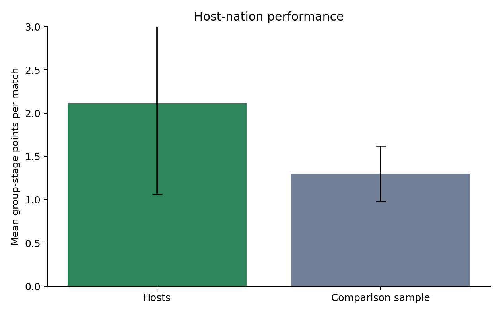

# Task 2: Did the host nations perform better?

**Member:** Thulith Hansana

## Research question

Did Canada, Mexico and the United States earn more group-stage points per match than a reproducible comparison sample of non-host teams?

The focal point is host-team match performance. Points were chosen instead of goals because they directly represent tournament results and avoid duplicating Task 1's focus on scoring frequency.

## Data and sampling

Only group-stage matches were used because the three-points-for-a-win system is meaningful in that stage. The host sample contains all nine group matches played by Canada, Mexico and the United States. A comparison observation was then drawn from each group match that did not involve a host nation. One of the two teams in each eligible match was selected with a fixed random seed of 140. This produced 63 comparison observations from distinct matches.

This design prevents both teams from the same comparison match entering the analysis, which would create direct dependence. Match points were coded as 3 for a win, 1 for a draw and 0 for a loss. The sampling method and seed are recorded in code so that the dataset can be reproduced exactly.

## Descriptive statistics

The host nations earned a mean of 2.11 points per match, with a standard deviation of 1.36 and a median of 3. The comparison sample earned a mean of 1.30 points, with a standard deviation of 1.28 and a median of 1. The observed mean difference was 0.81 points per match.

The 95% confidence interval for the host-minus-comparison difference ranged from -0.26 to 1.88 points. The wide interval reflects the small host sample and includes zero.

## Hypothesis test

The null hypothesis was that the two population means were equal. The alternative hypothesis was that they differed. A two-sided Welch two-sample t-test was used because the sample sizes were unequal and equal variances were not assumed.

The test returned (t = 1.68) and (p = 0.1239). The null hypothesis is therefore not rejected at the 0.05 level. The estimated effect size was (g = 0.62), which is moderate, but the uncertainty is too large to claim a reliable host advantage from these nine matches.

## Assumptions and sensitivity analysis

The match-level observations are independent because only one comparison team was selected from each non-host match. Points are discrete and bounded, so normality is not expected. Shapiro-Wilk tests confirmed non-normal distributions for the host sample, (p = 0.0005), and comparison sample, (p < 0.001).

A Mann-Whitney test was therefore included as a sensitivity analysis. It also failed to find a statistically significant difference, (U = 370.5), (p = 0.1173). Both methods lead to the same cautious interpretation.

## Interpretation and limitations

The hosts collected more points on average, but the evidence is inconclusive. Host status is also mixed with team strength, opponents, travel and scheduling. The analysis does not isolate crowd support as a causal mechanism. The host sample cannot be enlarged because each host played only three group matches, so the study has limited power. The fixed random comparison is reproducible, although a different random sample could change the estimate slightly.

## Conclusion

Canada, Mexico and the United States averaged 0.81 more group-stage points per match than the comparison sample. However, the confidence interval crossed zero and both statistical tests were non-significant. The defensible conclusion is that the observed pattern suggests a possible host advantage but does not establish one.

## Source

OpenFootball World Cup 2026 match data, retrieved 7 September 2026. The source details and official FIFA cross-check links are recorded in `data/SOURCES.md`.
