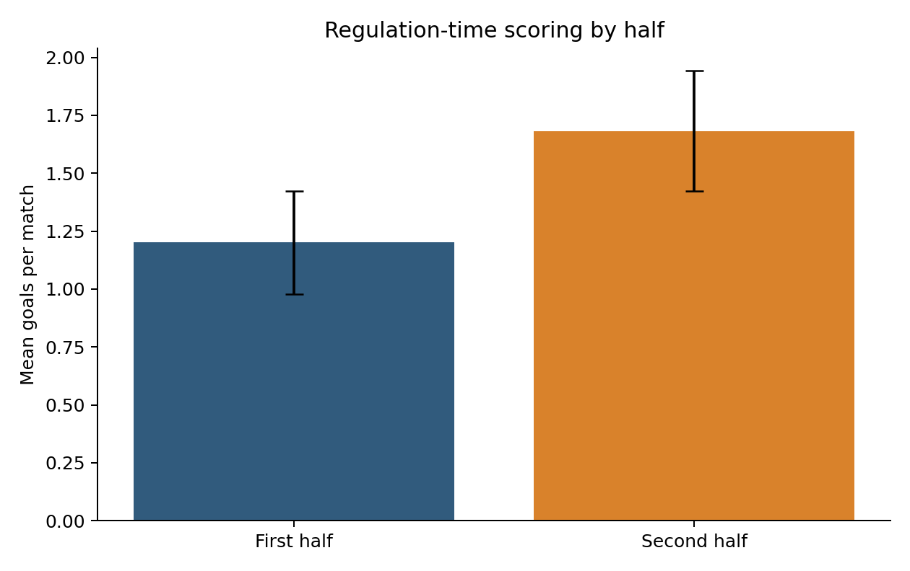

# Task 1: When were goals scored?

**Member:** Lahiru Samarasinghage

## Research question

Were more regulation-time goals scored after half-time than before half-time in the 2026 FIFA World Cup?

This question focuses on the timing of scoring rather than on player positions or tournament success. It is useful because substitutions, fatigue, tactical changes and the match score can all alter attacking behaviour after the break.

## Data and preparation

The source snapshot contains all 104 tournament matches. Half-time and full-time scores were extracted for every match. First-half goals were calculated as the sum of the two half-time scores. Second-half goals were calculated as the full-time score minus the half-time score. Extra-time goals were excluded so that every observation covered the same two 45-minute periods.

The population of interest is all matches in the 2026 tournament. Since the full set of 104 matches was available, this analysis used a tournament census rather than a sample. The match was the unit of analysis. Validation checks confirmed that every record contained half-time and full-time scores and that no calculated second-half value was negative.

## Descriptive statistics

First halves contained a mean of 1.20 goals per match, with a standard deviation of 1.14 and a median of 1. Second halves contained a mean of 1.68 goals, with a standard deviation of 1.33 and a median of 1. The observed mean increase was 0.48 goals per match.

The 95% confidence interval for the mean within-match difference was 0.16 to 0.80 goals. Because the interval does not include zero, the data support a positive average difference.

## Hypothesis test

The null hypothesis was that the population mean of the match-level difference, second-half goals minus first-half goals, was zero. The alternative hypothesis was that the mean difference was not zero. A two-sided one-sample t-test was applied to the 104 differences.

The result was statistically significant, (t(103) = 2.98), (p = 0.0035). The standardised effect was small, (d_z = 0.29). We therefore reject the null hypothesis and conclude that regulation-time scoring was higher after half-time in this tournament. The effect is statistically clear, but its size is modest.

## Assumptions and sensitivity analysis

Each match contributes one paired difference, so the observations are independent at match level. The differences were not normally distributed according to the Shapiro-Wilk test, (p = 0.0013). This is expected for small count differences. With 104 observations, the t-test is reasonably robust, but the non-normality should still be acknowledged.

A Wilcoxon signed-rank test was used as a sensitivity check. It also found evidence of a difference, (W = 806), (p = 0.0060). Agreement between the parametric and non-parametric results strengthens the conclusion.

## Interpretation and limitations

The analysis identifies a timing pattern, not its cause. Later scoring may reflect fatigue, substitutions, added tactical risk, or teams changing approach when behind. The source provides scores but does not measure these mechanisms. Stoppage time is included in its relevant half, and extra time is excluded. Treating the tournament as a census describes this event well, but inference to other World Cups requires caution.

## Conclusion

The 2026 tournament averaged 0.48 more goals per match after half-time than before it. The confidence interval, t-test and sensitivity test point in the same direction. The evidence supports a real second-half increase in this tournament, with a small standardised effect.

## Source

OpenFootball World Cup 2026 match data, retrieved 7 September 2026. The source details and official FIFA cross-check links are recorded in `data/SOURCES.md`.
