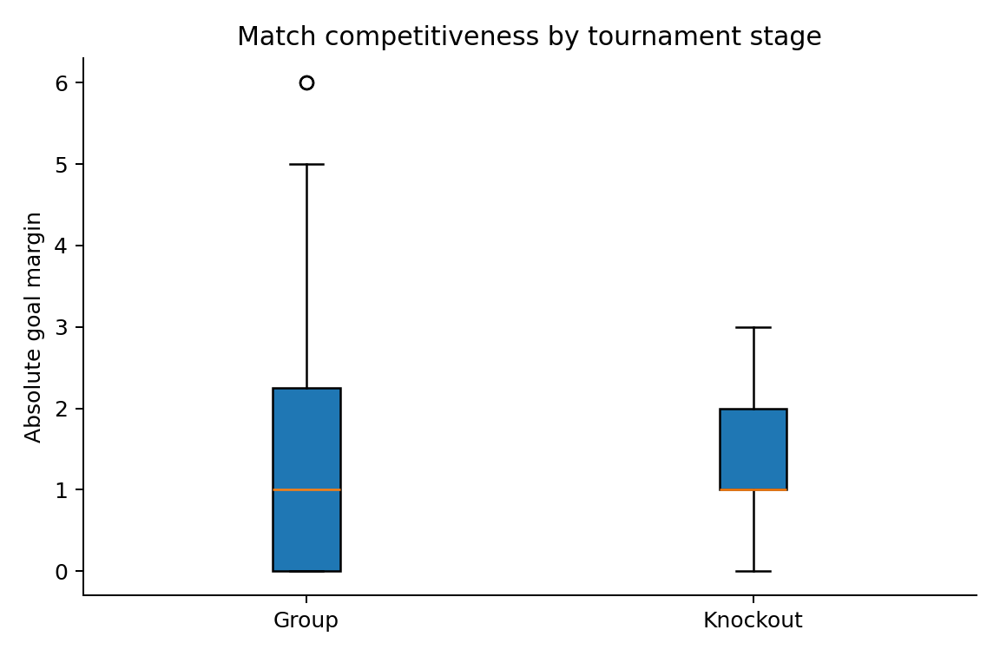

# Task 3: Were knockout matches closer?

**Member:** Sasindu Dilshan Ranwadana

## Research question

Were knockout matches more closely contested than group-stage matches in the 2026 FIFA World Cup?

Competitiveness was measured by the absolute goal margin. A value of zero represents a draw before a penalty shootout, one represents a one-goal match, and larger values represent less balanced scorelines.

## Data and preparation

All 104 matches were classified as group stage or knockout stage from the recorded round. There were 72 group matches and 32 knockout matches. For matches that went to extra time, the score after extra time was used. Shootout penalties were excluded because they decide advancement but are not part of the played match score.

The population of interest is the completed 2026 tournament. The full tournament was analysed, so no random sampling was required. Each match contributes one margin and appears in only one group.

## Descriptive statistics

Knockout matches had a mean absolute margin of 1.34 goals, a standard deviation of 0.87 and a median of 1. Group matches had a mean margin of 1.65 goals, a standard deviation of 1.54 and a median of 1. The observed knockout-minus-group difference was -0.31 goals, suggesting slightly closer knockout matches.

The 95% confidence interval for this mean difference was -0.78 to 0.16 goals. Since zero lies inside the interval, the direction and size of the population difference remain uncertain.

## Hypothesis test

The null hypothesis was that the mean absolute goal margin was equal in the two stages. The alternative hypothesis was that the means differed. A two-sided Welch two-sample t-test was used because the group-stage variance was visibly larger.

The result was (t = -1.30), (p = 0.1960). We do not reject the null hypothesis. The effect size was small, (g = -0.22). The tournament data do not provide strong evidence that knockout matches were more competitive, despite the lower observed mean margin.

## Assumptions and sensitivity analysis

Matches are independent units for this comparison. Absolute margins are non-negative counts and were non-normal in both groups. Shapiro-Wilk tests returned (p = 0.0003) for knockout matches and (p < 0.001) for group matches. Welch's test is preferable to the pooled-variance test, but the shape of the data still warrants a non-parametric check.

The Mann-Whitney sensitivity test returned (U = 1089), (p = 0.6493). It also found no statistically significant stage difference. The contrast between the two p-values reflects their different targets: Welch's test compares means, while Mann-Whitney is sensitive to broader distributional differences.

## Interpretation and limitations

Tournament format may produce competing effects. Elimination pressure can make teams cautious, while mismatched knockout pairings can still create large margins. Goal margin also ignores chance quality, possession and late tactical context. Penalty shootouts are coded as zero-margin matches because the playing score remained level, which is appropriate for competitive balance but should be stated clearly.

## Conclusion

Knockout matches were 0.31 goals closer on average, but the confidence interval included zero and neither test supported a reliable difference. The correct conclusion is not that the stages were identical, but that this tournament does not supply strong enough evidence of a difference in average scoreline competitiveness.

## Source

OpenFootball World Cup 2026 match data, retrieved 4 August 2026. The source details and official FIFA cross-check links are recorded in `data/SOURCES.md`.
