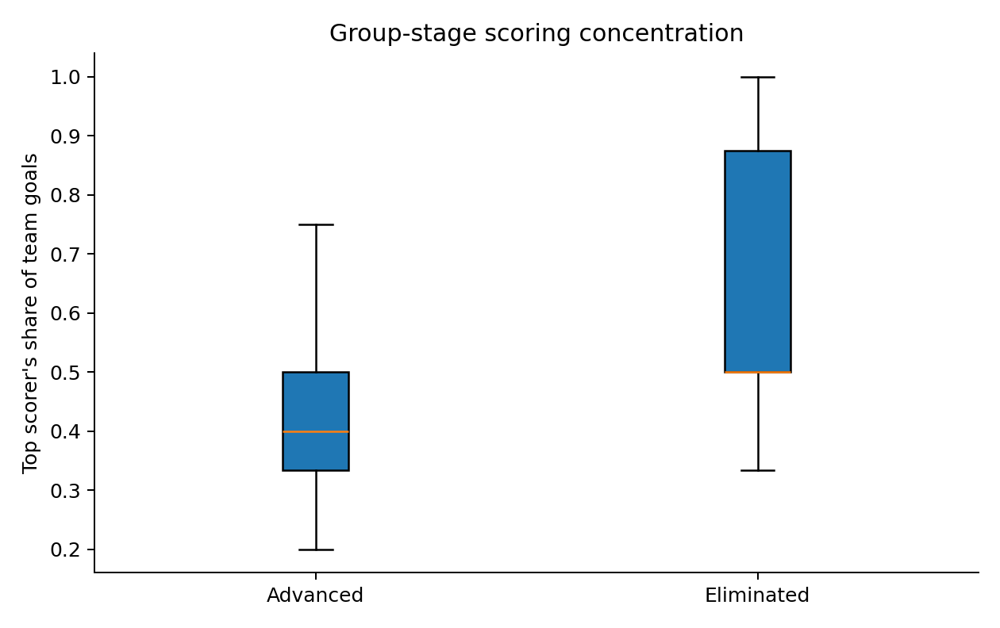

# Task 4: Did successful teams share their goals more widely?

**Member:** Senuja Berandeniya Aluthage

## Research question

Was group-stage scoring more concentrated in one player for teams that were eliminated than for teams that advanced to the knockout stage?

Scoring concentration was defined as the team's leading scorer's share of its group-stage goals. A value of 1 means one player scored every team goal. A smaller value indicates that goals were distributed across more players.

## Data and preparation

Goal-event names were collected from the 72 group-stage matches. Teams appearing in any knockout match were classified as advanced. For each team, the analysis counted total group-stage goals, unique scorers and the largest individual goal total. The concentration measure was the largest individual total divided by the team total.

Teams with no group-stage goals were excluded because the ratio is undefined. This left 47 teams: 32 that advanced and 15 that were eliminated. Using group-stage goals for both groups keeps the exposure window comparable and avoids giving successful teams extra matches in which to diversify their scorers.

## Descriptive statistics

For advancing teams, the leading scorer contributed a mean of 42.2% of group-stage goals. The standard deviation was 13.2%, the median was 40.0%, and the range was 20.0% to 75.0%. For eliminated teams, the mean was 65.0%, the standard deviation was 24.4%, the median was 50.0%, and the range was 33.3% to 100%.

The advanced-minus-eliminated mean difference was -22.8 percentage points. Its 95% confidence interval ranged from -36.9 to -8.7 percentage points.

## Hypothesis test

The null hypothesis was that mean scoring concentration was the same for advancing and eliminated teams. The alternative hypothesis was that the means differed. A two-sided Welch two-sample t-test was used because the spreads and sample sizes were unequal.

The result was statistically significant, (t = -3.39), (p = 0.0033). The estimated effect size was large, (g = -1.28). The data show that advancing teams distributed their group-stage goals across players more evenly than eliminated teams.

## Assumptions and sensitivity analysis

Each team contributes one ratio, so observations are independent at team level. The ratio is bounded and takes repeated fractional values, making perfect normality unlikely. Shapiro-Wilk tests indicated non-normality for advancing teams, (p = 0.0230), and eliminated teams, (p = 0.0127).

A Mann-Whitney test provided a non-parametric sensitivity check. It also found a difference, (U = 102), (p = 0.0013). The agreement supports the conclusion that the pattern is not an artefact of the t-test alone.

## Interpretation and limitations

The relationship is associative. A team may advance because it creates chances for several players, but winning more often may also allow a broader range of players to score. Opponent strength and tactical style are not controlled. Excluding the one scoreless team is necessary for the ratio but slightly changes the eliminated group. A larger top-scorer share can also arise mechanically when a team scores only one or two goals.

## Conclusion

Advancing teams had substantially lower group-stage scoring concentration. Their leading scorer accounted for about 42% of goals on average, compared with 65% among eliminated teams. The confidence interval, Welch test and sensitivity test all support a meaningful difference, while the observational design prevents a causal claim.

## Source

OpenFootball World Cup 2026 match data, retrieved 4 August 2026. The source details and official FIFA cross-check links are recorded in `data/SOURCES.md`.
